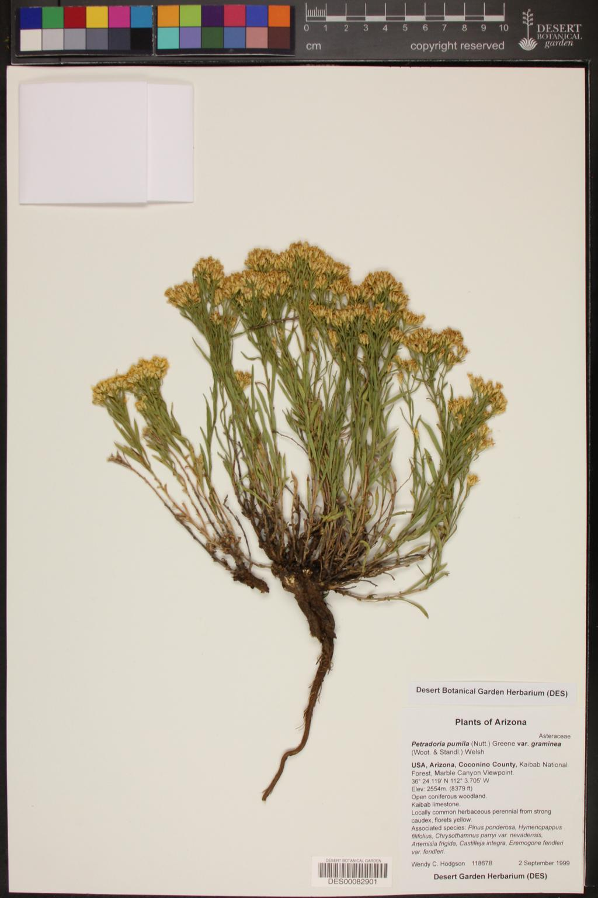

# phenobase 

Classifiers for identifying phenology traits on images of herbarium sheets.

There is a lot of effort to digitize and annotate photographs of plant images and herbarium specimens. However, this effort is, up until now, mostly manual, error-prone, and labor-intensive resulting in only a fraction of these images being fully annotated. This project uses neural networks to automate the annotation of some biologically significant traits related to [phenology](https://en.wikipedia.org/wiki/Phenology): flowering, fruiting, leaf-out, etc.

The basic steps are:

1. Have experts annotate traits on images of herbarium sheets.
2. Train a neural network(s) to recognize the traits. We are using the [pytorch](https://pytorch.org/) library to build the neural networks. I am also, using models and scripts from [HuggingFace](https://huggingface.co/docs/transformers/model_doc/vit_mae).
3. Use the trained neural networks to annotate images _en masse_.

## What we are doing
This project attempts to classify [phenological](https://en.wikipedia.org/wiki/Phenology) traits images of herbarium sheets, see figure 1. We want to identify these traits with reasonable speeds on batches of 1000s or possibly millions of images at a time.

The target traits are: flowers, fruits, and leaves. Each of these traits is binary, that is the herbarium specimen either has flowers (`with`) or it doesn't (`without`). All of these traits are not truly binary, for instance flowers may be in transition to fruits -- then which is it? However, in our training data, we are targeting traits as close as we can get to unambiguous presence or absence.

These traits may be easy to identify in some taxa, but the same trait in other taxa can be surprisingly difficult to identify, even by an expert under ideal conditions. Couple that with aging and deterioration of the herbarium specimens themselves and you wind up with ~~a difficult~~ an interesting problem. Sometimes traits too difficult to discern from the given images, so the expert identified these images as `unknown`. Finally, sometimes images are not appropriate as training data (like line drawings), and they are set to `not applicable`.

Our team consists of experts in botany and museum practices along with a computer programmer. Each of us used what we know best to shape the data and algorithms to improve the trait extraction process. In short, there has been a leaning curve, and there have been several iterations of scripting and training datasets.

(Fig. 1 An example of a herbarium sheet.)

## Methods

### Hardware

We use SLURM to submit jobs to the UF data center. The models we use are small and can typically fit on a single GPU, an NVidia A100 GPU. We also request 4 GB of memory and 4 CPUs per job for training models.

### Data

We start this process by gathering all the metadata available about the herbarium specimens and the corresponding images from data aggregators like GBIF, iNaturalist, and iDigBio. I should note that data aggregators typically do *not* store the images themselves but provide links to the images stored offsite. In a pilot study we used iDigBio data and still use some of that data. We subsequently switched to GBIF metadata. There is substantial overlap of the data between the data aggregators, so the decisions about which one to use is more about what aggregators are more up-to-date and which ones are easier to use. We put the metadata into a smallish (~65 GB) SQLite databases.

After we download the metadata we download the images. There may be issues with this process, and you may wind up with significant numbers of bad or blank images, zip bombs, and thumbnails, but most providers will serve full size images which can be very large. We mark the bad images and prepare the rest for further processing. Which leads to the next decision.

How large should our versions of the images be? seeing that saving the images as served would be space wasteful. Our purpose is to run these images through a neural network so we can use a size that is in the neighborhood of what is used as input to a neural network, but we also don't want to lock ourselves into a specific neural net. Our compromise is to resize the images (shrink) to have the smallest dimension to 1024 pixels while keeping the aspect ratio constant.

We then have a botany expert identify traits on a sample of the images. This data is split into a training, validation, and testing (holdout) datasets. We use 60% for training, 20% for validation, and 20% for testing splits.

### Starting iterations

Initially, the botany expert identified roughly 5000 images for each of the 3 traits. (Note: that the dataset has roughly doubled since then.) The programmer wrote the simplest algorithms that could possibly work by using a single model to identify all three traits; These are multi-label models. I.e. a single model simultaneously identifies the presence/absence of flowers, fruits, and leaves. The problem with this approach is you can shrink the training data trying to find sheets with all 3 traits identified as +/-. Another issue with this approach is that each trait may require different treatment of the data and by the models themselves - for instance weighting labels to handle class imbalances.

### Later iterations

We then moved on to each model identifying the presence or absence of a single trait. There are a few variants to this approach.
1. Where we predict a single value from 0.0 to 1.0 and update the result via a regression loss function. This is the normal way to handle a single binary trait.
2. Where we use a single label with 2 reciprocal classes, one for absence and one for presence. This came about while we were experimenting with multiple classes for each label, like flowers only, flowers with buds, and no flowers, etc. The programmer found that  it _sometimes_ worked better than regression.
3. Later in the training process we tried a 3rd approach where we used a single 0.0 to 1.0 value updated via regression, but we added a 3rd value of 0.5 for any trait labeled as unknown.

### Models

We mainly worked with 2 basic architectures: Google's EffNet and ViT. A classic convolutional network (EffNet) and a visual transformer network (ViT). Convolutional networks tend to be smaller so we can push a larger image size through the network. We found that in general the visual transformers worked better, but larger input images also beat smaller ones. So it is a balancing act between better networks, larger image sizes, and what can we fit on the available hardware (GPU). We used ViT networks of 224x224 pixel and 384x384 pixel sizes, and EffNets of 528x528 pixel and 600x600 pixel sizes.

Model training scores are standard, with a mean squared error loss for regression models, cross entropy loss for single label multi class models, and binary coded entropy with logits loss for multi label models.

During training of a model up to 5 checkpoints are saved. These use a different method of scoring to determine what are the best models. One method uses the model loss functions described above, but we typically use another metric for this purpose. Other methods use standard statistical methods like the precision, recall, accuracy, or F1.

Other parameters (epochs, learning rates, etc.)

### Data pruning

While auditing the results of models the botany expert identified certain taxa that were consistently misidentified for certain traits. For instance, it is notoriously hard to identify flowers and fruits on grasses. We started by just removing the problem taxa directly. The programmer was given a list of families to remove for flowers or fruits, and they were removed from the training data and during inference. This improved the scores but left the botany expert on the hook to do this manually for all new problem taxa introduced to the dataset.

Because of this we came up with a method that can programmatically remove problem taxa.The rules are:
1. Using all the current expert annotated records remove any genus that has an “unknown” annotation rate of 25% and also had more than 5 records in the genus.
2. Using the remaining records after genus filtering, remove any family that has an “unknown” annotation rate of 25% and also had more than 5 records in the family.

### Model scoring

Models give us raw logit scores which we convert into a 0 to 1 value using a sigmoid function for regression or multi-label classifications or a softmax function for single-label classifications.  The only trick is that for the reciprocal labels we only used the numerical value from the positive case; where you would normally use the greatest value from all the classes as the score.

For testing against the holdout set we compare these scores to the expert coded decisions. Because we want to keep false positives to a minimum we tended to use accuracy or precision as metrics to score the models themselves. Do not harm while still being helpful.

### Threshold moving

We could have considered the scores above 0.5 as present and those below as absent, but the scores around the middle are equivocal and indicate that the model itself is unsure of how to classify the image. So we use threshold moving. Threshold moving is finding the cutoff points high and low that maximize a metric, in this case accuracy. Images that have a score below the high threshold and above the low threshold are considered equivocal and are dropped. We do threshold moving for every model checkpoint which means that we can compare models to find the "best" one.

We want to find the best score, but we also want to classify as many images as possible, so we don't allow the moved thresholds to eliminate more than 30% of the records.

### Model inference

### Inference auditing

### Ensembles

- Hard voting
- Boosting?

### Model pretraining

One approach we tried early on was model pretraining. Our pretraining method trains a model to reproduce an image where you have distorted the input version of the image in some way, often by randomly erasing some of the input image. You distort the input image so the model learns what parameters are needed to recreate the image. You then take this pretrained model and finetune it identify the traits. The hope being that the learned parameters for image reconstruction are also useful for determining traits. These types of models are called autoencoders, which are an unsupervised machine learning technique. Our sister project identifying traits on images of live plants used this to great effect. Unfortunately, when we tried this we didn't have enough training images (~30,000) to do this properly. We now have well over 30 million images of herbarium sheets, and we should definitely try this approach again.

## Setup

1. `git clone https://github.com/rafelafrance/phenobase.git`
2. `cd phenobase`
3. `make install`
